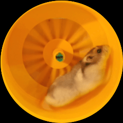

# HamsterWheel
Sourcecode for 3D printed Hamster Wheel powered by ESP32-S2 Breakout Board

___

___

Materials needed:

- Waveshare ESP32-S3-Zero Board
- GC9A01 1.28-inch Round TFT Display 
- 7x Wires 18-24 AWG

