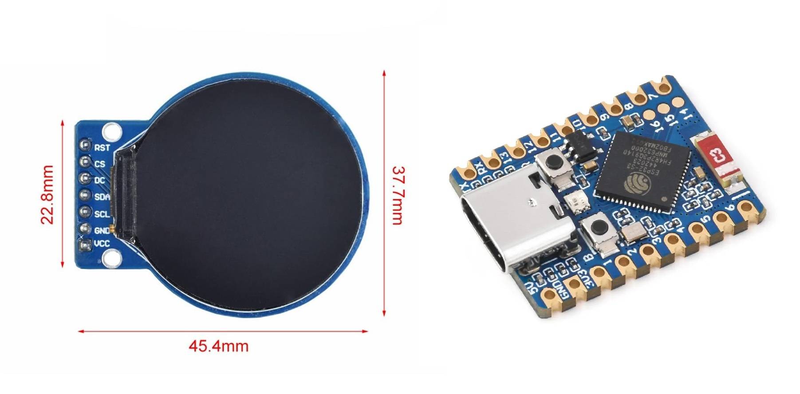

# HamsterWheel
Sourcecode for 3D printed Hamster Wheel powered by ESP32-S3 Breakout Board

| Project Build | Preview (Animated Video) |
|---|---|
|  |  |

___

Materials needed:

- Waveshare ESP32-S3-Zero Board
- GC9A01 1.28-inch Round TFT Display 
- Wire 18-24 AWG
- Paper Scraps
- Superglue

